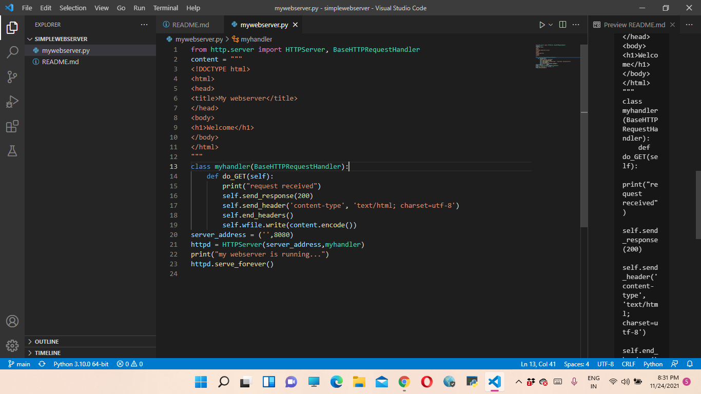

# Developing a Simple Webserver
## AIM:
To develop a simple webserver to display about top five programming languages

## DESIGN STEPS:

### Step 1:

HTML content creation
### Step 2:

Design of webserver workflow
### Step 3:

Implementation using Python code
### Step 4:

Serving the HTML pages.
### Step 5:

Testing the webserver

## PROGRAM:
```
from http.server import HTTPServer, BaseHTTPRequestHandler
content = """
<!DOCTYPE html>
<html>
<head>
<title>My webserver</title>
</head>
<body>
<h1>TOP FIVE PROGRAMMING LANGUAGES</h1>
<h3> python-
Python is a powerful general-purpose programming language. It is used in web development, data science, creating software prototypes, and so on. Fortunately for beginners, Python has simple easy-to-use syntax. This makes Python an excellent language to learn to program for beginners. </h3>

<h3> C program-
A successor to the programming language B, C was originally developed at Bell Labs by Dennis Ritchie between 1972 and 1973 to construct utilities running on Unix. It has become one of the most widely used programming languages,[7][8] with C compilers from various vendors available for the majority of existing computer architectures and operating systems. C has been standardized by ANSI since 1989 (ANSI C) and by the International Organization for Standardization (ISO). </h3>

<h3> C++ - C++ is an object-oriented programming language which gives a clear structure to programs and allows code to be reused, lowering development costs. C++ is portable and can be used to develop applications that can be adapted to multiple platforms. C++ is fun and easy to learn! </h3>

<h3> java-
Java is a programming language and computing platform first released by Sun Microsystems in 1995. It has evolved from humble beginnings to power a large share of today’s digital world, by providing the reliable platform upon which many services and applications are built. New, innovative products and digital services designed for the future continue to rely on Java, as well. </h3>

<h3> javascript-
JavaScript (often shortened to JS) is a lightweight, interpreted, object-oriented language with first-class functions, and is best known as the scripting language for Web pages, but it's used in many non-browser environments as well. ... JavaScript can function as both a procedural and an object oriented language. </h3>
</body>
</html>
"""
class myhandler(BaseHTTPRequestHandler):
    def do_GET(self):
        print("request received")
        self.send_response(200)
        self.send_header('content-type', 'text/html; charset=utf-8')
        self.end_headers()
        self.wfile.write(content.encode())
server_address = ('',8080)
httpd = HTTPServer(server_address,myhandler)
print("my webserver is running...")
httpd.serve_forever()
```


## OUTPUT:
### Server side Output

### Client side output


## RESULT:
Thus the webserver is developed is displayed about top five programming languages.
